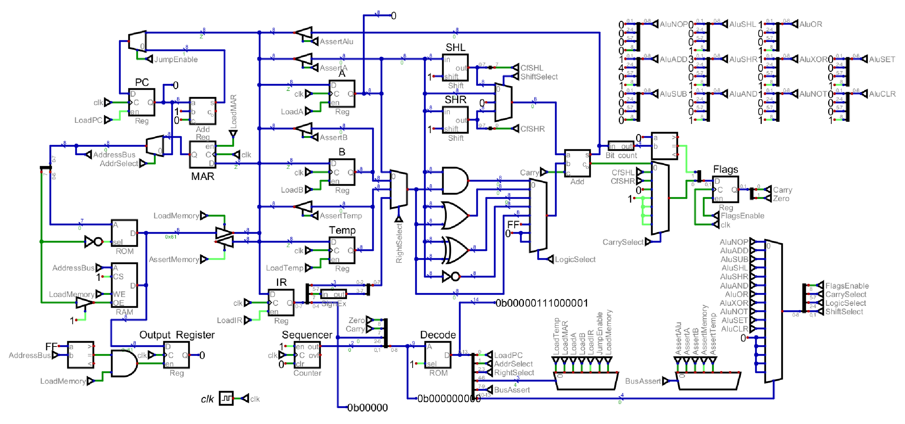

# `mc8`
A simple 8-bit CPU designed to be built in Minecraft.



### Quick Start

The CPU simulation is found in `cpu.dig`, where `.dig` is a file format for [Digital](https://github.com/hneemann/Digital). In order to run the simulation, you need to generate the microcode via the command below.
```
% python3 opcodes.py
```
The ROM chip in the simulation is configured to load the bootloader. The source is found in `boot.asm`. It must be assembled via [customasm](https://github.com/hlorenzi/customasm).
```
% mkdir bin/
% customasm asm/boot.asm -o bin/boot.bin
```
The emulator is found in `emu/` and should be compatible with most C++ compilers. With GCC:
```
% mkdir bin/
% g++ emu/main.cpp emu/mc8.cpp emu/dis.cpp emu/bus.cpp -o bin/emulator
```
The ROM file is provided via a command line argument:
```
% ./bin/emulator bin/boot.bin
```
For systems with GCC available, the `mc8.py` script can be used to perform builds and runs: `python mc8.py run rom_file` or
`python mc8.py build`.
## Programming Model

### Program Counter (8-bit)
Points to the location of the next instruction to be executed. During normal operation, this increments transparently to the programmer. Its value can be changed via a jump operation.

### A Register (8-bit)
The left hand operand and destination for all mathematical operations with full memory operation support.

### B Register (8-bit)
The right hand operand for many mathematical operations with full memory operation support.

### Status Register (2-bit)
- Carry Flag serves as the 9th bit for mathemtical operations. For shifts, this represents the bit which fell off as a result of the operation. For arithmetic operations, this denotes that the result is greater than 255 or less than 0. It is undefined for logical operations.
- Zero Flag denotes whether the result of the previous mathematical operation was zero. Subtracting two values and checking the zero flag can be used to determine equality.

## Instructions
The `mc8` instruction set uses opcodes encoded within five bits in order to simplify decoding. The top three bits are unused except for an *add with carry and small immediate* instruction, where they encode the immediate. Opcodes are followed by an optional 8-bit operand, which is either an immediate for mathematical operations or an address for memory and jump operations.

### No Operation (`nop`)
Do nothing. This instruction is uses as a placeholder and is used to provide delays within a program.

| Mnemonic | Address Mode | Carry Flag | Zero Flag |
| -------- | ------------ | ---------- | --------- |
| `nop`    | Implied      | Unchanged  | Unchanged |

### Swap Registers (`swap`)
Swap the values in the A and B registers.

| Mnemonic | Address Mode | Carry Flag | Zero Flag |
| -------- | ------------ | ---------- | --------- |
| `swap`   | Implied      | Unchanged  | Unchanged |

### Zero Registers (`zero`)
Set the A and B registers to zero.

| Mnemonic | Address Mode | Carry Flag | Zero Flag |
| -------- | ------------ | ---------- | --------- |
| `zero`   | Implied      | Unchanged  | Unchanged |

### Set Carry (`set`)
Set the carry flag to zero.

| Mnemonic | Address Mode | Carry Flag | Zero Flag |
| -------- | ------------ | ---------- | --------- |
| `set`    | Implied      | 1          | `TODO`    |

### Clear Carry (`clear`)
Set the carry flag to one.

| Mnemonic | Address Mode | Carry Flag | Zero Flag |
| -------- | ------------ | ---------- | --------- |
| `clear`  | Implied      | 0          | `TODO`    |

### Jump (`jmp`)
Jump to the specified address if the specified condition is true.

| Mnemonic            | Address Mode | Carry Flag | Zero Flag | Note                                         |
| ------------------- | ------------ | ---------- | --------- | -------------------------------------------- |
| `jmp.c {addr: u8}`  | Absolute     | Unchanged  | Unchanged | Jump to `addr` if the Carry Flag is set.     |
| `jmp.nc {addr: u8}` | Absolute     | Unchanged  | Unchanged | Jump to `addr` if the Carry Flag is not set. |
| `jmp.z {addr: u8}`  | Absolute     | Unchanged  | Unchanged | Jump to `addr` if the Zero Flag is set.      |
| `jmp.nz {addr: u8}` | Absolute     | Unchanged  | Unchanged | Jump to `addr` if the Zero Flag is not set.  |

### Add with Carry (`addc`)
Add with carry the value in the A register and a specified operand.

| Mnemonic               | Address Mode | Carry Flag            | Zero Flag |
| ---------------------- | ------------ | --------------------- | --------- |
| `addc a, b`            | Accumulator  | Updated               | Updated   |
| `addc a, {imm: i3}`    | Immediate    | Updated               | Updated   |
| `addc a, {imm: i8}`    | Immediate    | Updated               | Updated   |
| `addc a, [{addr: u8}]` | Indirect     | Updated               | Updated   |

### Subtract with Borrow (`subb`)
Subtract with borrow the specified operand from the value in the A register.

| Mnemonic               | Address Mode | Carry Flag            | Zero Flag |
| ---------------------- | ------------ | --------------------- | --------- |
| `subb a, b`            | Accumulator  | Updated               | Updated   |

### Shift Left (`shl`)
Shift the specified value by 0 - 7 bits to the left, filling the open bits on the right with zeroes.

### Logical Shift Right (`shr`)
Shift the value in the A register by 0 -7 bits to the right, filling the open bits on the left with zeroes.

### Compare Values (`cmp`)
Compare the value in the A register with a specified operand by subtracting them and discarding the result.

### Test Value (`test`)
Test the value of the specified operand by bitwise ANDind it with itself and discarding the result.

### Bitwise AND (`and`)
Bitwise AND the value in the A register and a specified operand and store the result in the A register.

### Bitwise OR (`or`)
Bitwise OR the value in the A register and a specified operand and store the result in the A register.

### Bitwise XOR (`xor`)
Bitwise XOR the value in the A register and a specified operand and store the result in the A register.

### Bitwise NOT (`not`)
Bitwise NOT the value in the A register and store the result in the A register.

### Load Register (`load`)
Load the specified register with a specified value.

### Store Register (`store`)
Store the specified register to a specified location.
